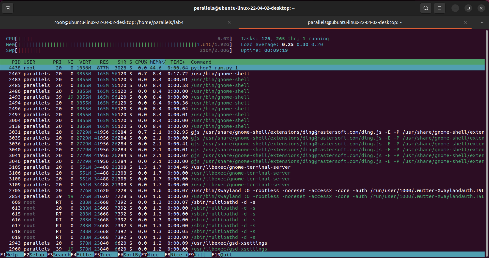

# Lab 4

[Lab 4 Assignment]()

- [4. Filesystem and Memory](#4-filesystem-and-memory)
    - [4.1. File Handle](#41-file-handle)
        - [Solution to Pseudocode:](#solution-to-pseudocode)
        - [What is the output of your implementation?](#what-is-the-output-of-your-implementation)
        - [What is a file descriptor?](#what-is-a-file-descriptor)
        - [Where can you find information about the file descriptor?](#where-can-you-find-information-about-the-file-descriptor-hint-a-process-is-an-instance-of-a-computer-program-that-is-being-executed)
        - [What does pos, flags and mnt_id mean?](#what-does-pos-flags-and-mnt_id-mean-hint-procpidfdinfo)
        - [What permissions do your files have?](#lets-have-a-look-at-the-files-what-permissions-do-your-files-have-hint-ls--lahi-procpidfd)
    - [4.2 Run the script every 10 minutes](#42-run-the-script-every-10-minutes)
        - [What is a cronjob?](#what-is-a-cronjob)
            - [Solution Cronjob](#solution-cronjob)
    - [4.3 While 1](#43-while-1)
        - [Solution to infinite Loop](#solution-infinite-loop)
        - [Find out the pid (Process ID) of the process and look at “/proc/$PID/maps”. What does
          the values mean?](#find-out-the-pid-pid-of-the-process-and-look-at-procpidmaps-what-do-the-values-mean)
        - [Look at “/proc/$PID/smaps”. What do the values Size, Rss, Pss, Shared_Clean,
          Shared_Dirty, Private_Clean, Private_Dirty, Referenced, Swap and SwapPss mean?](#look-at-procpidsmaps-what-do-the-values-size-rss-pss-shared_clean-shared_dirty-private_clean-private_dirty-referenced-swap-and-swappss-mean)
        - [What is the pagesize of your system?](#what-is-the-pagesize-of-your-system)
        - [How can you print out all major and minor pagefaults?]()
        - [Start htop and enter „swapoff –a“ on the terminal. What happens?](#start-htop-and-enter-swapoff-a-on-the-terminal-what-happens)
        - [Reboot your system and print out all your page faults again.](#reboot-your-system-and-print-out-all-your-page-faults-again)
    - [4.4 Fill the RAM](#44-fill-the-ram)
        - [Solution ram.py](#solution-rampy)
        - [Start the python script on your Ubuntu. Start the script with the following arguments: 1, 2, 3, 4
          and 5. (e.g.: python ram.py 1) What happens?](#start-the-python-script-on-your-ubuntu-start-the-script-with-the-following-arguments-1-2-3-4-and-5-eg-python-rampy-1-what-happens)
        - [Start htop and enter „swapoff –a“ on the terminal. Start the script with the following arguments: 1,
          2, 3, 4 and 5. What happens now? What has changed?](#start-htop-and-enter-swapoff-a-on-the-terminal-start-the-script-with-the-following-arguments-1-2-3-4-and-5-what-happens-now-what-has-changed)
        - [Try to change your operating system, to run the python script with all arguments (1, 2, 3, 4 and
          5).](#try-to-change-your-operating-system-to-run-the-python-script-with-all-arguments-1-2-3-4-and-5)
        - [Compare the “/proc/meminfo” or “htop” with a running ram.py and a not running ram.py.](#compare-the-procmeminfo-or-htop-with-a-running-rampy-and-a-not-running-rampy)
        - [What is paging?](#what-is-paging)

## 4. Filesystem and Memory

For the fourth exercise you have to use python3 as programming language

### 4.1. File Handle

Implement the following pseudocode-functions.

```
procedure write_to_file(filename):
    for i=0 to 25
        print_to_standard_out("Write Line: " + i + actual_timestamp())
        write_to_file(filename, “Write Line: ” + i + actual_timestamp())
        wait 1 second
procedure append_to_file(filename):
    for i=0 to 25
        print_to_standard_out("Append Line: " + i + actual_timestamp()))
        append_to_file(filename, “Append Line: ” + i + actual_timestamp())
        wait 1 second
procedure read_from_file(filename):
    for i=0 to number_of_rows(filename)
        print_to_standard_out(filename_row_number[i]))
        wait 1 second
procedure main()
    write_to_file(file1.txt):
    append_to_file(file2.txt):
    read_from_file (file1.txt):
    read_from_file (file2.txt):
```

#### Solution to Pseudocode:

```python3
#!/usr/bin/python3

import time
from datetime import datetime


def write_to_file(filename):
    """
    Writes lines to a file, each line containing a sequence number and a timestamp.

    Args:
    filename (str): The name of the file to write to.

    This function opens a file in write mode, which means it will overwrite the existing file
    if it already exists. It writes 26 lines to the file, each with a unique number and the
    current timestamp. There is a 1-second pause between each write.
    """
    with open(filename, 'w') as file:
        for i in range(26):
            timestamp = datetime.now().strftime("%Y-%m-%d %H:%M:%S")  # looks like 2023-12-15 17:55:33
            line = f"Write Line: {i} {timestamp}\n"
            print(line.strip())
            file.write(line)
            time.sleep(1)  # Pause for 1 second between writes for demonstration purposes.


def append_to_file(filename):
    """
    Appends lines to a file, each line containing a sequence number and a timestamp.

    Args:
    filename (str): The name of the file to append to.

    This function opens a file in append mode. If the file does not exist, it gets created.
    It appends 26 lines to the file, each with a unique number and the current timestamp.
    There is a 1-second pause between each append.
    """
    with open(filename, 'a') as file:
        for i in range(26):
            timestamp = datetime.now().strftime("%Y-%m-%d %H:%M:%S")
            line = f"Append Line: {i} {timestamp}\n"
            print(line.strip())
            file.write(line)
            time.sleep(1)


def read_from_file(filename):
    """
    Reads lines from a file and prints them to the console.

    Args:
    filename (str): The name of the file to read from.

    This function opens a file in read mode and reads all its lines into a list. It then
    iterates over the list, printing each line with its line number. There is a 1-second
    pause between printing each line.
    """
    with open(filename, 'r') as file:
        lines = file.readlines()
        for i, line in enumerate(lines):
            print(f"{i}: {line.strip()}")
            time.sleep(1)


def main():
    """
    Main function to demonstrate file operations.

    This function demonstrates writing to, appending to, and reading from files.
    It uses two files, 'file1.txt' and 'file2.txt', to showcase these operations.
    """
    write_to_file("file1.txt")
    append_to_file("file2.txt")
    read_from_file("file1.txt")
    read_from_file("file2.txt")
    exit(1)


if __name__ == "__main__":
    main()

```

Source: https://www.digitalocean.com/community/tutorials/how-to-handle-plain-text-files-in-python-3

#### What is the output of your implementation?

````bash
c2310475021@os-server:~/lab_4$ ./file_handle.py
Write Line: 0 2023-12-15 17:54:41
Write Line: 1 2023-12-15 17:54:42
Write Line: 2 2023-12-15 17:54:43
Write Line: 3 2023-12-15 17:54:44
Write Line: 4 2023-12-15 17:54:45
Write Line: 5 2023-12-15 17:54:46
Write Line: 6 2023-12-15 17:54:47
Write Line: 7 2023-12-15 17:54:48
Write Line: 8 2023-12-15 17:54:49
Write Line: 9 2023-12-15 17:54:50
Write Line: 10 2023-12-15 17:54:51
Write Line: 11 2023-12-15 17:54:52
Write Line: 12 2023-12-15 17:54:53
Write Line: 13 2023-12-15 17:54:54
Write Line: 14 2023-12-15 17:54:55
Write Line: 15 2023-12-15 17:54:56
Write Line: 16 2023-12-15 17:54:57
Write Line: 17 2023-12-15 17:54:58
Write Line: 18 2023-12-15 17:54:59
Write Line: 19 2023-12-15 17:55:00
Write Line: 20 2023-12-15 17:55:01
Write Line: 21 2023-12-15 17:55:02
Write Line: 22 2023-12-15 17:55:03
Write Line: 23 2023-12-15 17:55:04
Write Line: 24 2023-12-15 17:55:05
Write Line: 25 2023-12-15 17:55:06
Append Line: 0 2023-12-15 17:55:07
Append Line: 1 2023-12-15 17:55:08
Append Line: 2 2023-12-15 17:55:09
Append Line: 3 2023-12-15 17:55:10
Append Line: 4 2023-12-15 17:55:11
Append Line: 5 2023-12-15 17:55:12
Append Line: 6 2023-12-15 17:55:13
Append Line: 7 2023-12-15 17:55:14
Append Line: 8 2023-12-15 17:55:16
Append Line: 9 2023-12-15 17:55:17
Append Line: 10 2023-12-15 17:55:18
Append Line: 11 2023-12-15 17:55:19
Append Line: 12 2023-12-15 17:55:20
Append Line: 13 2023-12-15 17:55:21
Append Line: 14 2023-12-15 17:55:22
Append Line: 15 2023-12-15 17:55:23
Append Line: 16 2023-12-15 17:55:24
Append Line: 17 2023-12-15 17:55:25
Append Line: 18 2023-12-15 17:55:26
Append Line: 19 2023-12-15 17:55:27
Append Line: 20 2023-12-15 17:55:28
Append Line: 21 2023-12-15 17:55:29
Append Line: 22 2023-12-15 17:55:30
Append Line: 23 2023-12-15 17:55:31
Append Line: 24 2023-12-15 17:55:32
Append Line: 25 2023-12-15 17:55:33
0: Write Line: 0 2023-12-15 17:54:41
1: Write Line: 1 2023-12-15 17:54:42
2: Write Line: 2 2023-12-15 17:54:43
3: Write Line: 3 2023-12-15 17:54:44
4: Write Line: 4 2023-12-15 17:54:45
5: Write Line: 5 2023-12-15 17:54:46
6: Write Line: 6 2023-12-15 17:54:47
7: Write Line: 7 2023-12-15 17:54:48
8: Write Line: 8 2023-12-15 17:54:49
9: Write Line: 9 2023-12-15 17:54:50
10: Write Line: 10 2023-12-15 17:54:51
11: Write Line: 11 2023-12-15 17:54:52
12: Write Line: 12 2023-12-15 17:54:53
13: Write Line: 13 2023-12-15 17:54:54
14: Write Line: 14 2023-12-15 17:54:55
15: Write Line: 15 2023-12-15 17:54:56
16: Write Line: 16 2023-12-15 17:54:57
17: Write Line: 17 2023-12-15 17:54:58
18: Write Line: 18 2023-12-15 17:54:59
19: Write Line: 19 2023-12-15 17:55:00
20: Write Line: 20 2023-12-15 17:55:01
21: Write Line: 21 2023-12-15 17:55:02
22: Write Line: 22 2023-12-15 17:55:03
23: Write Line: 23 2023-12-15 17:55:04
24: Write Line: 24 2023-12-15 17:55:05
25: Write Line: 25 2023-12-15 17:55:06
0: Append Line: 0 2023-12-15 17:55:07
1: Append Line: 1 2023-12-15 17:55:08
2: Append Line: 2 2023-12-15 17:55:09
3: Append Line: 3 2023-12-15 17:55:10
4: Append Line: 4 2023-12-15 17:55:11
5: Append Line: 5 2023-12-15 17:55:12
6: Append Line: 6 2023-12-15 17:55:13
7: Append Line: 7 2023-12-15 17:55:14
8: Append Line: 8 2023-12-15 17:55:16
9: Append Line: 9 2023-12-15 17:55:17
10: Append Line: 10 2023-12-15 17:55:18
11: Append Line: 11 2023-12-15 17:55:19
12: Append Line: 12 2023-12-15 17:55:20
13: Append Line: 13 2023-12-15 17:55:21
14: Append Line: 14 2023-12-15 17:55:22
15: Append Line: 15 2023-12-15 17:55:23
16: Append Line: 16 2023-12-15 17:55:24
17: Append Line: 17 2023-12-15 17:55:25
18: Append Line: 18 2023-12-15 17:55:26
19: Append Line: 19 2023-12-15 17:55:27
20: Append Line: 20 2023-12-15 17:55:28
21: Append Line: 21 2023-12-15 17:55:29
22: Append Line: 22 2023-12-15 17:55:30
23: Append Line: 23 2023-12-15 17:55:31
24: Append Line: 24 2023-12-15 17:55:32
25: Append Line: 25 2023-12-15 17:55:33
c2310475021@os-server:~/lab_4$ ls
file1.txt  file2.txt  file_handle.py
````

#### What is a file descriptor

A file descriptor, as described in "Operating System Concepts" (10th Edition) by Abraham Silberschatz, is essentially an
index into a small table of open files for a process. Here are some key points about file descriptors based on this
definition:

* **Index in Open File Table**: A file descriptor is a numerical handle that uniquely identifies an open file within a
  process. It acts as an index in a table maintained by the operating system, where each entry in the table points to an
  open file.
* **Standard Descriptors**: File descriptors start at 0. The first three descriptors (0, 1, and 2) are typically
  reserved
  for standard input, standard output, and standard error, respectively.
* **Limited Range**: In most typical programs, file descriptors seldom exceed a small number, such as 6 or 7. This is
  because there's usually a limit to the number of files a process can open simultaneously.
* **File Offset Management**: Each time a file is read from or written to, the current offset in the file is updated.
  This
  offset is maintained in association with the file-table entry for that file and determines the position in the file
  for the next read or write operation.
* **Position Manipulation**: The lseek() system call allows explicit resetting of the file position, which is crucial
  for
  operations like seeking to a specific location in a file or creating sparse files.
* **Duplication and Control**: System calls like dup() and dup2() can be used to create new file descriptors that are
  copies
  of an existing one. Additionally, the fcntl() system call can be used to examine or set various parameters of an open
  file, including manipulation of its file descriptor.

File descriptors are a fundamental concept in operating systems, especially in Unix-like systems, where they provide a
low-level mechanism for file manipulation and I/O operations.

#### Where can you find information about the file descriptor? (Hint: A process is an instance of a computer program that is being executed)

Information about a process's file descriptors can be found in the Linux filesystem under the **_/proc_** directory.
Specifically, for each running process, there is a corresponding directory in **_/proc_** named after the process ID (
PID).
Within this directory, you can find detailed information about the file descriptors being used by the process.

Here are the specific locations where you can find information about file descriptors:

* **/proc/[PID]/fd**: This directory contains entries for each file descriptor that the process has open. Each entry is
  a symbolic link to the actual file or resource (like a socket or pipe) that the file descriptor references. By
  inspecting these links, you can determine what files, sockets, or other resources the process is currently using.
* **/proc/[PID]/fdinfo**: This directory provides detailed information about each file descriptor. Each file in this
  directory corresponds to a file descriptor and contains data such as the current file offset (pos), file status
  flags (flags), and mount point ID (mnt_id) associated with the file descriptor.

To access this information, you would replace **[PID]** with the actual process ID of the process you're interested in.
You
can find the process ID using commands like **ps**, **top**, or **htop**.

For example, if you want to inspect the file descriptors for a process with PID 1234, you would look at **/proc/1234/fd
**
and **/proc/1234/fdinfo**.

Remember, accessing these directories requires appropriate permissions. You might need superuser (root) privileges,
especially if you're inspecting a process that you don't own.

#### What does pos, flags and mnt_id mean? (Hint: “/proc/$PID/fdinfo”)

In the context of `/proc/$PID/fdinfo` on a Linux system, `pos`, `flags`, and `mnt_id` provide detailed
information about each file descriptor used by the process. Here's what each of these terms represents:

1. **pos**: This stands for "position." It indicates the current file offset for the file descriptor. This is
   essentially the position within the file where the next read or write operation will begin. For instance, if `pos` is
   set to 100, it means that the next read/write operation on this file descriptor will start from the 100th byte in the
   file.
2. **flags**: These are the file status flags associated with the file descriptor. They provide information about how
   the file or resource is being accessed. Common flags include whether the file is open for reading, writing, is set to
   append on each write, is non-blocking, and other such operational modes. These flags are often represented in a
   numeric format, and you can decode them to understand the file's access and status mode.
3. **mnt_id**: This stands for "mount identifier." It's a unique identifier for the mount point in the filesystem where
   the file or resource associated with the file descriptor is located. This is useful for tracking the actual physical
   or logical storage location being accessed by the process. For example, files on different mounted drives or network
   locations will have different `mnt_id` values.

Together, these pieces of information provide a comprehensive view of how a particular file or resource is being
accessed by a process at a given moment. This can be very useful for debugging, performance analysis, and understanding
the behavior of running processes on a Linux system.

#### Let’s have a look at the files. What permissions do your files have? (Hint: “ls -lahi proc/$PID/fd/”)

```bash
c2310475021@os-server:~$ ps -u c2310475021 --forest
    PID TTY          TIME CMD
  38697 ?        00:00:00 sshd
  38698 pts/15   00:00:00  \_ bash
  39153 pts/15   00:00:00      \_ ps
  26741 ?        00:00:00 sshd
  26742 pts/4    00:00:00  \_ bash
  39049 pts/4    00:00:00      \_ file_handle.py
  26661 ?        00:00:00 systemd
  26664 ?        00:00:00  \_ (sd-pam)
c2310475021@os-server:~$ ls -lahi /proc/39049/fd/
total 0
491781 dr-x------ 2 c2310475021 student  0 Dec 15 18:20 .
468911 dr-xr-xr-x 9 c2310475021 student  0 Dec 15 18:19 ..
491784 lrwx------ 1 c2310475021 student 64 Dec 15 18:20 0 -> /dev/pts/4
491785 lrwx------ 1 c2310475021 student 64 Dec 15 18:20 1 -> /dev/pts/4
491786 lrwx------ 1 c2310475021 student 64 Dec 15 18:20 2 -> /dev/pts/4
491787 lr-x------ 1 c2310475021 student 64 Dec 15 18:20 3 -> /home/c2310475021/lab_4/file2.txt
c2310475021@os-server:~/lab_4$ ls -lahi
total 20K
800282 drwxr-xr-x  2 c2310475021 student 4.0K Dec 15 17:55 .
526006 drwxr-xr-x 12 c2310475021 student 4.0K Dec 15 17:54 ..
800308 -rw-r--r--  1 c2310475021 student  900 Dec 15 18:19 file1.txt
800310 -rw-r--r--  1 c2310475021 student 2.8K Dec 15 18:19 file2.txt
800309 -rwxrwxrwx  1 c2310475021 student 2.7K Dec 15 17:54 file_handle.py
```

Let's break down the permissions part of the Linux file listing for your examples:

##### Example 1: `file1.txt`

```
800308 -rw-r--r--  1 c2310475021 student  900 Dec 15 18:19 file1.txt
```

##### Example 2: `file2.txt`

```
800310 -rw-r--r--  1 c2310475021 student 2.8K Dec 15 18:19 file2.txt
```

For both examples, the format is similar, so I'll explain using `file1.txt` as the reference:

1. **800308**: This is the inode number of the file `file1.txt`. It's a unique identifier for the file within the
   filesystem.
2. **-rw-r--r--**: This represents the file permissions. Let's break this down:

    - `-`: The first character indicates the type of file. A dash (`-`) signifies that this is a regular file. Other
      possibilities include `d` for directory, `l` for symbolic link, etc.
    - `rw-`: The next three characters represent the permissions for the user who owns the file (`c2310475021` in this
      case). Here, `rw-` means the user has read (`r`) and write (`w`) permissions, but no execute (`x`) permission.
    - `r--`: The following three characters are the permissions for the group that owns the file (`student` in this
      case). `r--` means the group members can read the file but cannot write (`w`) or execute (`x`) it.
    - `r--`: The last three characters are the permissions for others (everyone else). Similar to the group, others can
      only read the file.
3. **1**: This number shows the count of hard links to this file. It indicates how many different directory entries
   point to this inode.
4. **c2310475021**: The name of the user who owns the file.
5. **student**: The name of the group that owns the file.
6. **900**: The size of the file in bytes. In the case of `file2.txt`, it's `2.8K`, indicating the file is 2.8 kilobytes
   in size.
7. **Dec 15 18:19**: The date and time when the file was last modified.
8. **file1.txt**: The name of the file.

Understanding file permissions is crucial for managing access and ensuring security on a Linux system. The permissions
determine who can read, write, or execute the file, which affects how the file can be used or modified.

**For the next 3 Tasks you must install Ubuntu on your own Machine**

1 CPU Core, 2 GB RAM, 32 GB HDD

[Linux and Windows](https://ubuntu.com/tutorials/how-to-run-ubuntu-desktop-on-a-virtual-machine-using-virtualbox#1-overview)
[Linux and Windows YT Video](https://www.youtube.com/watch?v=v1JVqd8M3Yc)
[Mac M1](https://freegistutorial.com/install-ubuntu-22-10-on-m1-mac/)
[Mac](https://www.youtube.com/watch?v=EiO_CHfSn2s)

### 4.2 Run the script every 10 minutes

Use the [Cron-Daemon](https://wiki.ubuntuusers.de/Cron/) to run the script from 4.1 every 10 minutes.

#### What is a cronjob?

A cron job is a scheduled task in Unix and Unix-like operating systems, used for running specific tasks at predetermined
times or intervals. It's a fundamental tool for system maintenance and automation. The cron system is driven by a daemon
known as `crond` (cron daemon), which executes scheduled tasks based on definitions in crontab files.

Each user on a system can have their own crontab file, where they specify commands and the exact times for execution.
These commands are then executed by the cron daemon at the specified times. The syntax for scheduling a task in a
crontab file involves specifying the minute, hour, day of the month, month, day of the week, and the command to be
executed.

Cron jobs are widely used for a variety of system administration tasks, including backups, system updates, and regular
maintenance tasks. They're especially useful for automating repetitive tasks that need to run at regular intervals.

For more detailed and specific information on cron jobs and their usage in Ubuntu systems, you can refer to the Ubuntu
Users Cron Wiki page [here](https://wiki.ubuntuusers.de/Cron/).

#### Solution Cronjob:

```bash
root@ubuntu-linux-22-04-02-desktop:/home/parallels# crontab -l
*/10 * * * * /usr/bin/python3 /home/parallels/lab4/file_handle.py
```

### 4.3 While 1

Add an infinite loop to your code.

```
procedure main()
    while(1)
        write_to_file(file1):
        append_to_file(file2):
```

#### Solution Infinite Loop:

```python3
def main():
    while True:
        write_to_file("file1.txt")
        append_to_file("file2.txt")
```

#### Find out the pid ($PID) of the process and look at “/proc/$PID/maps”. What do the values mean?

```bash
root@ubuntu-linux-22-04-02-desktop:/home/parallels/lab4# ps aux --forest
root        1154  0.0  0.1   4032  2404 ?        Ss   19:49   0:00 /usr/sbin/cron -f -P
root       10137  0.0  0.1   9804  3804 ?        S    20:30   0:00  \_ /usr/sbin/CRON -f -P
root       10139  0.0  0.0   2308   832 ?        Ss   20:30   0:00      \_ /bin/sh -c /usr/bin/python3 /home/parallels/lab4/file_handle.py
root       10140  0.0  0.3  12624  7928 ?        S    20:30   0:00          \_ /usr/bin/python3 /home/parallels/lab4/file_handle.py

root@ubuntu-linux-22-04-02-desktop:/home/parallels/lab4# cat /proc/10140/maps
aaaaadda0000-aaaaae2c3000 r-xp 00000000 08:02 2359360 /usr/bin/python3.10
aaaaae2d2000-aaaaae2d9000 r--p 00522000 08:02 2359360 /usr/bin/python3.10
aaaaae2d9000-aaaaae318000 rw-p 00529000 08:02 2359360 /usr/bin/python3.10
aaaaae318000-aaaaae35d000 rw-p 00000000 00:00 0
aaaaaf358000-aaaaaf41d000 rw-p 00000000 00:00 0                          [heap]
ffffbdf02000-ffffbe189000 rw-p 00000000 00:00 0
ffffbe189000-ffffbe1e0000 r--p 00000000 08:02 2361335 /usr/lib/locale/C.utf8/LC_CTYPE
ffffbe1e0000-ffffbe369000 r-xp 00000000 08:02 2359316 /usr/lib/aarch64-linux-gnu/libc.so.6
ffffbe369000-ffffbe378000 ---p 00189000 08:02 2359316 /usr/lib/aarch64-linux-gnu/libc.so.6
ffffbe378000-ffffbe37c000 r--p 00188000 08:02 2359316 /usr/lib/aarch64-linux-gnu/libc.so.6
ffffbe37c000-ffffbe37e000 rw-p 0018c000 08:02 2359316 /usr/lib/aarch64-linux-gnu/libc.so.6
ffffbe37e000-ffffbe38a000 rw-p 00000000 00:00 0
ffffbe390000-ffffbe3a8000 r-xp 00000000 08:02 2360649 /usr/lib/aarch64-linux-gnu/libz.so.1.2.11
ffffbe3a8000-ffffbe3b8000 ---p 00018000 08:02 2360649 /usr/lib/aarch64-linux-gnu/libz.so.1.2.11
ffffbe3b8000-ffffbe3b9000 r--p 00018000 08:02 2360649 /usr/lib/aarch64-linux-gnu/libz.so.1.2.11
ffffbe3b9000-ffffbe3ba000 rw-p 00019000 08:02 2360649 /usr/lib/aarch64-linux-gnu/libz.so.1.2.11
ffffbe3c0000-ffffbe3e7000 r-xp 00000000 08:02 2360496 /usr/lib/aarch64-linux-gnu/libexpat.so.1.8.7
ffffbe3e7000-ffffbe3f7000 ---p 00027000 08:02 2360496 /usr/lib/aarch64-linux-gnu/libexpat.so.1.8.7
ffffbe3f7000-ffffbe3f9000 r--p 00027000 08:02 2360496 /usr/lib/aarch64-linux-gnu/libexpat.so.1.8.7
ffffbe3f9000-ffffbe3fa000 rw-p 00029000 08:02 2360496 /usr/lib/aarch64-linux-gnu/libexpat.so.1.8.7
ffffbe400000-ffffbe486000 r-xp 00000000 08:02 2359328 /usr/lib/aarch64-linux-gnu/libm.so.6
ffffbe486000-ffffbe495000 ---p 00086000 08:02 2359328 /usr/lib/aarch64-linux-gnu/libm.so.6
ffffbe495000-ffffbe496000 r--p 00085000 08:02 2359328 /usr/lib/aarch64-linux-gnu/libm.so.6
ffffbe496000-ffffbe497000 rw-p 00086000 08:02 2359328 /usr/lib/aarch64-linux-gnu/libm.so.6
ffffbe4a8000-ffffbe4d3000 r-xp 00000000 08:02 2359309 /usr/lib/aarch64-linux-gnu/ld-linux-aarch64.so.1
ffffbe4d4000-ffffbe4db000 r--s 00000000 08:02 2373375 /usr/lib/aarch64-linux-gnu/gconv/gconv-modules.cache
ffffbe4db000-ffffbe4df000 rw-p 00000000 00:00 0
ffffbe4df000-ffffbe4e1000 r--p 00000000 00:00 0                          [vvar]
ffffbe4e1000-ffffbe4e2000 r-xp 00000000 00:00 0                          [vdso]
ffffbe4e2000-ffffbe4e4000 r--p 0002a000 08:02 2359309 /usr/lib/aarch64-linux-gnu/ld-linux-aarch64.so.1
ffffbe4e4000-ffffbe4e6000 rw-p 0002c000 08:02 2359309 /usr/lib/aarch64-linux-gnu/ld-linux-aarch64.so.1
ffffe0503000-ffffe0524000 rw-p 00000000 00:00 0                          [stack]

```

The output of `/proc/$PID/maps` provides a detailed view of a process's memory mapping. Each line represents a
memory region. Let's break down what the values mean:

- **Memory Address Range**: `aaaaadda0000-aaaaae2c3000`. This is the range of virtual memory addresses allocated to this
  region.
- **Permissions**: `r-xp`. These indicate the memory region's permissions: `r` for read, `w` for write, `x` for
  execute, `p` for private (copy-on-write).
- **Offset**: `00000000`. The offset into the file/region where the mapping begins.
- **Device**: `08:02`. The major and minor device numbers (in hexadecimal) identifying the device.
- **Inode**: `2359360`. The inode on the device of the file that backs the mapping.
- **Path**: `/usr/bin/python3.10`. The file path associated with the region, if applicable.

This file is useful for understanding the memory layout of a process, including which parts of the process's address
space are mapped to which files, and with what permissions. It can help in debugging, performance tuning, and security
analysis.

Source: https://stackoverflow.com/a/1401595/23129477, https://man7.org/linux/man-pages/man5/proc.5.html

#### Look at “/proc/$PID/smaps”. What do the values Size, Rss, Pss, Shared_Clean, Shared_Dirty, Private_Clean, Private_Dirty, Referenced, Swap and SwapPss mean?

The `/proc/$PID/smaps` file provides detailed memory usage statistics for each memory region of a process. Here's
what the values mean:

- **Size**: Total size of the memory region.
- **Rss (Resident Set Size)**: Amount of physical memory currently used by the region.
- **Pss (Proportional Set Size)**: Rss value divided proportionally among processes sharing this memory.
- **Shared_Clean and Shared_Dirty**: Memory that could be potentially shared with other processes (Clean: not modified
  since loading; Dirty: modified).
- **Private_Clean and Private_Dirty**: Private memory regions (Clean: not modified; Dirty: modified).
- **Referenced**: Amount of memory currently marked as accessed.
- **Anonymous**: Memory areas that don't belong to any file.
- **Swap**: Amount of swapped out memory.
- **SwapPss**: Proportional amount of Swap used, similar to Pss.

These values are useful for understanding a process's memory consumption and behavior, especially in shared and private
memory contexts.

Source: https://unix.stackexchange.com/questions/33381/getting-information-about-a-process-memory-usage-from-proc-pid-smaps, https://man7.org/linux/man-pages/man5/proc.5.html

Output:

```bash
root@ubuntu-linux-22-04-02-desktop:/home/parallels/lab4# cat /proc/10140/smaps
aaaaadda0000-aaaaae2c3000 r-xp 00000000 08:02 2359360                    /usr/bin/python3.10
Size:               5260 kB
KernelPageSize:        4 kB
MMUPageSize:           4 kB
Rss:                3288 kB
Pss:                 822 kB
Shared_Clean:       3288 kB
Shared_Dirty:          0 kB
Private_Clean:         0 kB
Private_Dirty:         0 kB
Referenced:         3288 kB
Anonymous:             0 kB
LazyFree:              0 kB
AnonHugePages:         0 kB
ShmemPmdMapped:        0 kB
FilePmdMapped:         0 kB
Shared_Hugetlb:        0 kB
Private_Hugetlb:       0 kB
Swap:                  0 kB
SwapPss:               0 kB
Locked:                0 kB
THPeligible:    0
VmFlags: rd ex mr mw me 
aaaaae2d2000-aaaaae2d9000 r--p 00522000 08:02 2359360                    /usr/bin/python3.10
Size:                 28 kB
KernelPageSize:        4 kB
MMUPageSize:           4 kB
Rss:                  28 kB
Pss:                  28 kB
Shared_Clean:          0 kB
Shared_Dirty:          0 kB
Private_Clean:         0 kB
Private_Dirty:        28 kB
Referenced:           28 kB
Anonymous:            28 kB
LazyFree:              0 kB
AnonHugePages:         0 kB
ShmemPmdMapped:        0 kB
FilePmdMapped:         0 kB
Shared_Hugetlb:        0 kB
Private_Hugetlb:       0 kB
Swap:                  0 kB
SwapPss:               0 kB
Locked:                0 kB
THPeligible:    0
VmFlags: rd mr mw me ac 
aaaaae2d9000-aaaaae318000 rw-p 00529000 08:02 2359360                    /usr/bin/python3.10
Size:                252 kB
KernelPageSize:        4 kB
MMUPageSize:           4 kB
Rss:                 252 kB
Pss:                 252 kB
Shared_Clean:          0 kB
Shared_Dirty:          0 kB
Private_Clean:         0 kB
Private_Dirty:       252 kB
Referenced:          240 kB
Anonymous:           252 kB
LazyFree:              0 kB
AnonHugePages:         0 kB
ShmemPmdMapped:        0 kB
FilePmdMapped:         0 kB
Shared_Hugetlb:        0 kB
Private_Hugetlb:       0 kB
Swap:                  0 kB
SwapPss:               0 kB
Locked:                0 kB
THPeligible:    0
VmFlags: rd wr mr mw me ac 
aaaaae318000-aaaaae35d000 rw-p 00000000 00:00 0 
Size:                276 kB
KernelPageSize:        4 kB
MMUPageSize:           4 kB
Rss:                  16 kB
Pss:                  16 kB
Shared_Clean:          0 kB
Shared_Dirty:          0 kB
Private_Clean:         0 kB
Private_Dirty:        16 kB
Referenced:           12 kB
Anonymous:            16 kB
LazyFree:              0 kB
AnonHugePages:         0 kB
ShmemPmdMapped:        0 kB
FilePmdMapped:         0 kB
Shared_Hugetlb:        0 kB
Private_Hugetlb:       0 kB
Swap:                  0 kB
SwapPss:               0 kB
Locked:                0 kB
THPeligible:    0
VmFlags: rd wr mr mw me ac 
aaaaaf358000-aaaaaf41d000 rw-p 00000000 00:00 0                          [heap]
Size:                788 kB
KernelPageSize:        4 kB
MMUPageSize:           4 kB
Rss:                 744 kB
Pss:                 744 kB
Shared_Clean:          0 kB
Shared_Dirty:          0 kB
Private_Clean:         0 kB
Private_Dirty:       744 kB
Referenced:          700 kB
Anonymous:           744 kB
LazyFree:              0 kB
AnonHugePages:         0 kB
ShmemPmdMapped:        0 kB
FilePmdMapped:         0 kB
Shared_Hugetlb:        0 kB
Private_Hugetlb:       0 kB
Swap:                  0 kB
SwapPss:               0 kB
Locked:                0 kB
THPeligible:    0
VmFlags: rd wr mr mw me ac 
ffffbdf02000-ffffbe189000 rw-p 00000000 00:00 0 
Size:               2588 kB
KernelPageSize:        4 kB
MMUPageSize:           4 kB
Rss:                1868 kB
Pss:                1868 kB
Shared_Clean:          0 kB
Shared_Dirty:          0 kB
Private_Clean:         0 kB
Private_Dirty:      1868 kB
Referenced:         1732 kB
Anonymous:          1868 kB
LazyFree:              0 kB
AnonHugePages:         0 kB
ShmemPmdMapped:        0 kB
FilePmdMapped:         0 kB
Shared_Hugetlb:        0 kB
Private_Hugetlb:       0 kB
Swap:                  0 kB
SwapPss:               0 kB
Locked:                0 kB
THPeligible:    0
VmFlags: rd wr mr mw me ac 
ffffbe189000-ffffbe1e0000 r--p 00000000 08:02 2361335                    /usr/lib/locale/C.utf8/LC_CTYPE
Size:                348 kB
KernelPageSize:        4 kB
MMUPageSize:           4 kB
Rss:                 124 kB
Pss:                   1 kB
Shared_Clean:        124 kB
Shared_Dirty:          0 kB
Private_Clean:         0 kB
Private_Dirty:         0 kB
Referenced:          124 kB
Anonymous:             0 kB
LazyFree:              0 kB
AnonHugePages:         0 kB
ShmemPmdMapped:        0 kB
FilePmdMapped:         0 kB
Shared_Hugetlb:        0 kB
Private_Hugetlb:       0 kB
Swap:                  0 kB
SwapPss:               0 kB
Locked:                0 kB
THPeligible:    0
VmFlags: rd mr mw me 
ffffbe1e0000-ffffbe369000 r-xp 00000000 08:02 2359316                    /usr/lib/aarch64-linux-gnu/libc.so.6
Size:               1572 kB
KernelPageSize:        4 kB
MMUPageSize:           4 kB
Rss:                1280 kB
Pss:                  10 kB
Shared_Clean:       1280 kB
Shared_Dirty:          0 kB
Private_Clean:         0 kB
Private_Dirty:         0 kB
Referenced:         1280 kB
Anonymous:             0 kB
LazyFree:              0 kB
AnonHugePages:         0 kB
ShmemPmdMapped:        0 kB
FilePmdMapped:         0 kB
Shared_Hugetlb:        0 kB
Private_Hugetlb:       0 kB
Swap:                  0 kB
SwapPss:               0 kB
Locked:                0 kB
THPeligible:    0
VmFlags: rd ex mr mw me 
ffffbe369000-ffffbe378000 ---p 00189000 08:02 2359316                    /usr/lib/aarch64-linux-gnu/libc.so.6
Size:                 60 kB
KernelPageSize:        4 kB
MMUPageSize:           4 kB
Rss:                   0 kB
Pss:                   0 kB
Shared_Clean:          0 kB
Shared_Dirty:          0 kB
Private_Clean:         0 kB
Private_Dirty:         0 kB
Referenced:            0 kB
Anonymous:             0 kB
LazyFree:              0 kB
AnonHugePages:         0 kB
ShmemPmdMapped:        0 kB
FilePmdMapped:         0 kB
Shared_Hugetlb:        0 kB
Private_Hugetlb:       0 kB
Swap:                  0 kB
SwapPss:               0 kB
Locked:                0 kB
THPeligible:    0
VmFlags: mr mw me 
ffffbe378000-ffffbe37c000 r--p 00188000 08:02 2359316                    /usr/lib/aarch64-linux-gnu/libc.so.6
Size:                 16 kB
KernelPageSize:        4 kB
MMUPageSize:           4 kB
Rss:                  16 kB
Pss:                  16 kB
Shared_Clean:          0 kB
Shared_Dirty:          0 kB
Private_Clean:         0 kB
Private_Dirty:        16 kB
Referenced:           16 kB
Anonymous:            16 kB
LazyFree:              0 kB
AnonHugePages:         0 kB
ShmemPmdMapped:        0 kB
FilePmdMapped:         0 kB
Shared_Hugetlb:        0 kB
Private_Hugetlb:       0 kB
Swap:                  0 kB
SwapPss:               0 kB
Locked:                0 kB
THPeligible:    0
VmFlags: rd mr mw me ac 
ffffbe37c000-ffffbe37e000 rw-p 0018c000 08:02 2359316                    /usr/lib/aarch64-linux-gnu/libc.so.6
Size:                  8 kB
KernelPageSize:        4 kB
MMUPageSize:           4 kB
Rss:                   8 kB
Pss:                   8 kB
Shared_Clean:          0 kB
Shared_Dirty:          0 kB
Private_Clean:         0 kB
Private_Dirty:         8 kB
Referenced:            8 kB
Anonymous:             8 kB
LazyFree:              0 kB
AnonHugePages:         0 kB
ShmemPmdMapped:        0 kB
FilePmdMapped:         0 kB
Shared_Hugetlb:        0 kB
Private_Hugetlb:       0 kB
Swap:                  0 kB
SwapPss:               0 kB
Locked:                0 kB
THPeligible:    0
VmFlags: rd wr mr mw me ac 
ffffbe37e000-ffffbe38a000 rw-p 00000000 00:00 0 
Size:                 48 kB
KernelPageSize:        4 kB
MMUPageSize:           4 kB
Rss:                  16 kB
Pss:                  16 kB
Shared_Clean:          0 kB
Shared_Dirty:          0 kB
Private_Clean:         0 kB
Private_Dirty:        16 kB
Referenced:           16 kB
Anonymous:            16 kB
LazyFree:              0 kB
AnonHugePages:         0 kB
ShmemPmdMapped:        0 kB
FilePmdMapped:         0 kB
Shared_Hugetlb:        0 kB
Private_Hugetlb:       0 kB
Swap:                  0 kB
SwapPss:               0 kB
Locked:                0 kB
THPeligible:    0
VmFlags: rd wr mr mw me ac 
ffffbe390000-ffffbe3a8000 r-xp 00000000 08:02 2360649                    /usr/lib/aarch64-linux-gnu/libz.so.1.2.11
Size:                 96 kB
KernelPageSize:        4 kB
MMUPageSize:           4 kB
Rss:                  64 kB
Pss:                   0 kB
Shared_Clean:         64 kB
Shared_Dirty:          0 kB
Private_Clean:         0 kB
Private_Dirty:         0 kB
Referenced:           64 kB
Anonymous:             0 kB
LazyFree:              0 kB
AnonHugePages:         0 kB
ShmemPmdMapped:        0 kB
FilePmdMapped:         0 kB
Shared_Hugetlb:        0 kB
Private_Hugetlb:       0 kB
Swap:                  0 kB
SwapPss:               0 kB
Locked:                0 kB
THPeligible:    0
VmFlags: rd ex mr mw me 
ffffbe3a8000-ffffbe3b8000 ---p 00018000 08:02 2360649                    /usr/lib/aarch64-linux-gnu/libz.so.1.2.11
Size:                 64 kB
KernelPageSize:        4 kB
MMUPageSize:           4 kB
Rss:                   0 kB
Pss:                   0 kB
Shared_Clean:          0 kB
Shared_Dirty:          0 kB
Private_Clean:         0 kB
Private_Dirty:         0 kB
Referenced:            0 kB
Anonymous:             0 kB
LazyFree:              0 kB
AnonHugePages:         0 kB
ShmemPmdMapped:        0 kB
FilePmdMapped:         0 kB
Shared_Hugetlb:        0 kB
Private_Hugetlb:       0 kB
Swap:                  0 kB
SwapPss:               0 kB
Locked:                0 kB
THPeligible:    0
VmFlags: mr mw me 
ffffbe3b8000-ffffbe3b9000 r--p 00018000 08:02 2360649                    /usr/lib/aarch64-linux-gnu/libz.so.1.2.11
Size:                  4 kB
KernelPageSize:        4 kB
MMUPageSize:           4 kB
Rss:                   4 kB
Pss:                   4 kB
Shared_Clean:          0 kB
Shared_Dirty:          0 kB
Private_Clean:         0 kB
Private_Dirty:         4 kB
Referenced:            4 kB
Anonymous:             4 kB
LazyFree:              0 kB
AnonHugePages:         0 kB
ShmemPmdMapped:        0 kB
FilePmdMapped:         0 kB
Shared_Hugetlb:        0 kB
Private_Hugetlb:       0 kB
Swap:                  0 kB
SwapPss:               0 kB
Locked:                0 kB
THPeligible:    0
VmFlags: rd mr mw me ac 
ffffbe3b9000-ffffbe3ba000 rw-p 00019000 08:02 2360649                    /usr/lib/aarch64-linux-gnu/libz.so.1.2.11
Size:                  4 kB
KernelPageSize:        4 kB
MMUPageSize:           4 kB
Rss:                   4 kB
Pss:                   4 kB
Shared_Clean:          0 kB
Shared_Dirty:          0 kB
Private_Clean:         0 kB
Private_Dirty:         4 kB
Referenced:            4 kB
Anonymous:             4 kB
LazyFree:              0 kB
AnonHugePages:         0 kB
ShmemPmdMapped:        0 kB
FilePmdMapped:         0 kB
Shared_Hugetlb:        0 kB
Private_Hugetlb:       0 kB
Swap:                  0 kB
SwapPss:               0 kB
Locked:                0 kB
THPeligible:    0
VmFlags: rd wr mr mw me ac 
ffffbe3c0000-ffffbe3e7000 r-xp 00000000 08:02 2360496                    /usr/lib/aarch64-linux-gnu/libexpat.so.1.8.7
Size:                156 kB
KernelPageSize:        4 kB
MMUPageSize:           4 kB
Rss:                  64 kB
Pss:                   1 kB
Shared_Clean:         64 kB
Shared_Dirty:          0 kB
Private_Clean:         0 kB
Private_Dirty:         0 kB
Referenced:           64 kB
Anonymous:             0 kB
LazyFree:              0 kB
AnonHugePages:         0 kB
ShmemPmdMapped:        0 kB
FilePmdMapped:         0 kB
Shared_Hugetlb:        0 kB
Private_Hugetlb:       0 kB
Swap:                  0 kB
SwapPss:               0 kB
Locked:                0 kB
THPeligible:    0
VmFlags: rd ex mr mw me 
ffffbe3e7000-ffffbe3f7000 ---p 00027000 08:02 2360496                    /usr/lib/aarch64-linux-gnu/libexpat.so.1.8.7
Size:                 64 kB
KernelPageSize:        4 kB
MMUPageSize:           4 kB
Rss:                   0 kB
Pss:                   0 kB
Shared_Clean:          0 kB
Shared_Dirty:          0 kB
Private_Clean:         0 kB
Private_Dirty:         0 kB
Referenced:            0 kB
Anonymous:             0 kB
LazyFree:              0 kB
AnonHugePages:         0 kB
ShmemPmdMapped:        0 kB
FilePmdMapped:         0 kB
Shared_Hugetlb:        0 kB
Private_Hugetlb:       0 kB
Swap:                  0 kB
SwapPss:               0 kB
Locked:                0 kB
THPeligible:    0
VmFlags: mr mw me 
ffffbe3f7000-ffffbe3f9000 r--p 00027000 08:02 2360496                    /usr/lib/aarch64-linux-gnu/libexpat.so.1.8.7
Size:                  8 kB
KernelPageSize:        4 kB
MMUPageSize:           4 kB
Rss:                   8 kB
Pss:                   8 kB
Shared_Clean:          0 kB
Shared_Dirty:          0 kB
Private_Clean:         0 kB
Private_Dirty:         8 kB
Referenced:            8 kB
Anonymous:             8 kB
LazyFree:              0 kB
AnonHugePages:         0 kB
ShmemPmdMapped:        0 kB
FilePmdMapped:         0 kB
Shared_Hugetlb:        0 kB
Private_Hugetlb:       0 kB
Swap:                  0 kB
SwapPss:               0 kB
Locked:                0 kB
THPeligible:    0
VmFlags: rd mr mw me ac 
ffffbe3f9000-ffffbe3fa000 rw-p 00029000 08:02 2360496                    /usr/lib/aarch64-linux-gnu/libexpat.so.1.8.7
Size:                  4 kB
KernelPageSize:        4 kB
MMUPageSize:           4 kB
Rss:                   4 kB
Pss:                   4 kB
Shared_Clean:          0 kB
Shared_Dirty:          0 kB
Private_Clean:         0 kB
Private_Dirty:         4 kB
Referenced:            4 kB
Anonymous:             4 kB
LazyFree:              0 kB
AnonHugePages:         0 kB
ShmemPmdMapped:        0 kB
FilePmdMapped:         0 kB
Shared_Hugetlb:        0 kB
Private_Hugetlb:       0 kB
Swap:                  0 kB
SwapPss:               0 kB
Locked:                0 kB
THPeligible:    0
VmFlags: rd wr mr mw me ac 
ffffbe400000-ffffbe486000 r-xp 00000000 08:02 2359328                    /usr/lib/aarch64-linux-gnu/libm.so.6
Size:                536 kB
KernelPageSize:        4 kB
MMUPageSize:           4 kB
Rss:                  64 kB
Pss:                   0 kB
Shared_Clean:         64 kB
Shared_Dirty:          0 kB
Private_Clean:         0 kB
Private_Dirty:         0 kB
Referenced:           64 kB
Anonymous:             0 kB
LazyFree:              0 kB
AnonHugePages:         0 kB
ShmemPmdMapped:        0 kB
FilePmdMapped:         0 kB
Shared_Hugetlb:        0 kB
Private_Hugetlb:       0 kB
Swap:                  0 kB
SwapPss:               0 kB
Locked:                0 kB
THPeligible:    0
VmFlags: rd ex mr mw me 
ffffbe486000-ffffbe495000 ---p 00086000 08:02 2359328                    /usr/lib/aarch64-linux-gnu/libm.so.6
Size:                 60 kB
KernelPageSize:        4 kB
MMUPageSize:           4 kB
Rss:                   0 kB
Pss:                   0 kB
Shared_Clean:          0 kB
Shared_Dirty:          0 kB
Private_Clean:         0 kB
Private_Dirty:         0 kB
Referenced:            0 kB
Anonymous:             0 kB
LazyFree:              0 kB
AnonHugePages:         0 kB
ShmemPmdMapped:        0 kB
FilePmdMapped:         0 kB
Shared_Hugetlb:        0 kB
Private_Hugetlb:       0 kB
Swap:                  0 kB
SwapPss:               0 kB
Locked:                0 kB
THPeligible:    0
VmFlags: mr mw me 
ffffbe495000-ffffbe496000 r--p 00085000 08:02 2359328                    /usr/lib/aarch64-linux-gnu/libm.so.6
Size:                  4 kB
KernelPageSize:        4 kB
MMUPageSize:           4 kB
Rss:                   4 kB
Pss:                   4 kB
Shared_Clean:          0 kB
Shared_Dirty:          0 kB
Private_Clean:         0 kB
Private_Dirty:         4 kB
Referenced:            4 kB
Anonymous:             4 kB
LazyFree:              0 kB
AnonHugePages:         0 kB
ShmemPmdMapped:        0 kB
FilePmdMapped:         0 kB
Shared_Hugetlb:        0 kB
Private_Hugetlb:       0 kB
Swap:                  0 kB
SwapPss:               0 kB
Locked:                0 kB
THPeligible:    0
VmFlags: rd mr mw me ac 
ffffbe496000-ffffbe497000 rw-p 00086000 08:02 2359328                    /usr/lib/aarch64-linux-gnu/libm.so.6
Size:                  4 kB
KernelPageSize:        4 kB
MMUPageSize:           4 kB
Rss:                   4 kB
Pss:                   4 kB
Shared_Clean:          0 kB
Shared_Dirty:          0 kB
Private_Clean:         0 kB
Private_Dirty:         4 kB
Referenced:            4 kB
Anonymous:             4 kB
LazyFree:              0 kB
AnonHugePages:         0 kB
ShmemPmdMapped:        0 kB
FilePmdMapped:         0 kB
Shared_Hugetlb:        0 kB
Private_Hugetlb:       0 kB
Swap:                  0 kB
SwapPss:               0 kB
Locked:                0 kB
THPeligible:    0
VmFlags: rd wr mr mw me ac 
ffffbe4a8000-ffffbe4d3000 r-xp 00000000 08:02 2359309                    /usr/lib/aarch64-linux-gnu/ld-linux-aarch64.so.1
Size:                172 kB
KernelPageSize:        4 kB
MMUPageSize:           4 kB
Rss:                 160 kB
Pss:                   1 kB
Shared_Clean:        160 kB
Shared_Dirty:          0 kB
Private_Clean:         0 kB
Private_Dirty:         0 kB
Referenced:          160 kB
Anonymous:             0 kB
LazyFree:              0 kB
AnonHugePages:         0 kB
ShmemPmdMapped:        0 kB
FilePmdMapped:         0 kB
Shared_Hugetlb:        0 kB
Private_Hugetlb:       0 kB
Swap:                  0 kB
SwapPss:               0 kB
Locked:                0 kB
THPeligible:    0
VmFlags: rd ex mr mw me 
ffffbe4d4000-ffffbe4db000 r--s 00000000 08:02 2373375                    /usr/lib/aarch64-linux-gnu/gconv/gconv-modules.cache
Size:                 28 kB
KernelPageSize:        4 kB
MMUPageSize:           4 kB
Rss:                  28 kB
Pss:                   0 kB
Shared_Clean:         28 kB
Shared_Dirty:          0 kB
Private_Clean:         0 kB
Private_Dirty:         0 kB
Referenced:           28 kB
Anonymous:             0 kB
LazyFree:              0 kB
AnonHugePages:         0 kB
ShmemPmdMapped:        0 kB
FilePmdMapped:         0 kB
Shared_Hugetlb:        0 kB
Private_Hugetlb:       0 kB
Swap:                  0 kB
SwapPss:               0 kB
Locked:                0 kB
THPeligible:    0
VmFlags: rd mr me ms 
ffffbe4db000-ffffbe4df000 rw-p 00000000 00:00 0 
Size:                 16 kB
KernelPageSize:        4 kB
MMUPageSize:           4 kB
Rss:                  16 kB
Pss:                  16 kB
Shared_Clean:          0 kB
Shared_Dirty:          0 kB
Private_Clean:         0 kB
Private_Dirty:        16 kB
Referenced:           12 kB
Anonymous:            16 kB
LazyFree:              0 kB
AnonHugePages:         0 kB
ShmemPmdMapped:        0 kB
FilePmdMapped:         0 kB
Shared_Hugetlb:        0 kB
Private_Hugetlb:       0 kB
Swap:                  0 kB
SwapPss:               0 kB
Locked:                0 kB
THPeligible:    0
VmFlags: rd wr mr mw me ac 
ffffbe4df000-ffffbe4e1000 r--p 00000000 00:00 0                          [vvar]
Size:                  8 kB
KernelPageSize:        4 kB
MMUPageSize:           4 kB
Rss:                   0 kB
Pss:                   0 kB
Shared_Clean:          0 kB
Shared_Dirty:          0 kB
Private_Clean:         0 kB
Private_Dirty:         0 kB
Referenced:            0 kB
Anonymous:             0 kB
LazyFree:              0 kB
AnonHugePages:         0 kB
ShmemPmdMapped:        0 kB
FilePmdMapped:         0 kB
Shared_Hugetlb:        0 kB
Private_Hugetlb:       0 kB
Swap:                  0 kB
SwapPss:               0 kB
Locked:                0 kB
THPeligible:    0
VmFlags: rd mr pf de 
ffffbe4e1000-ffffbe4e2000 r-xp 00000000 00:00 0                          [vdso]
Size:                  4 kB
KernelPageSize:        4 kB
MMUPageSize:           4 kB
Rss:                   4 kB
Pss:                   0 kB
Shared_Clean:          4 kB
Shared_Dirty:          0 kB
Private_Clean:         0 kB
Private_Dirty:         0 kB
Referenced:            4 kB
Anonymous:             0 kB
LazyFree:              0 kB
AnonHugePages:         0 kB
ShmemPmdMapped:        0 kB
FilePmdMapped:         0 kB
Shared_Hugetlb:        0 kB
Private_Hugetlb:       0 kB
Swap:                  0 kB
SwapPss:               0 kB
Locked:                0 kB
THPeligible:    0
VmFlags: rd ex mr mw me de 
ffffbe4e2000-ffffbe4e4000 r--p 0002a000 08:02 2359309                    /usr/lib/aarch64-linux-gnu/ld-linux-aarch64.so.1
Size:                  8 kB
KernelPageSize:        4 kB
MMUPageSize:           4 kB
Rss:                   8 kB
Pss:                   8 kB
Shared_Clean:          0 kB
Shared_Dirty:          0 kB
Private_Clean:         0 kB
Private_Dirty:         8 kB
Referenced:            8 kB
Anonymous:             8 kB
LazyFree:              0 kB
AnonHugePages:         0 kB
ShmemPmdMapped:        0 kB
FilePmdMapped:         0 kB
Shared_Hugetlb:        0 kB
Private_Hugetlb:       0 kB
Swap:                  0 kB
SwapPss:               0 kB
Locked:                0 kB
THPeligible:    0
VmFlags: rd mr mw me ac 
ffffbe4e4000-ffffbe4e6000 rw-p 0002c000 08:02 2359309                    /usr/lib/aarch64-linux-gnu/ld-linux-aarch64.so.1
Size:                  8 kB
KernelPageSize:        4 kB
MMUPageSize:           4 kB
Rss:                   8 kB
Pss:                   8 kB
Shared_Clean:          0 kB
Shared_Dirty:          0 kB
Private_Clean:         0 kB
Private_Dirty:         8 kB
Referenced:            8 kB
Anonymous:             8 kB
LazyFree:              0 kB
AnonHugePages:         0 kB
ShmemPmdMapped:        0 kB
FilePmdMapped:         0 kB
Shared_Hugetlb:        0 kB
Private_Hugetlb:       0 kB
Swap:                  0 kB
SwapPss:               0 kB
Locked:                0 kB
THPeligible:    0
VmFlags: rd wr mr mw me ac 
ffffe0503000-ffffe0524000 rw-p 00000000 00:00 0                          [stack]
Size:                132 kB
KernelPageSize:        4 kB
MMUPageSize:           4 kB
Rss:                  56 kB
Pss:                  56 kB
Shared_Clean:          0 kB
Shared_Dirty:          0 kB
Private_Clean:         0 kB
Private_Dirty:        56 kB
Referenced:           48 kB
Anonymous:            56 kB
LazyFree:              0 kB
AnonHugePages:         0 kB
ShmemPmdMapped:        0 kB
FilePmdMapped:         0 kB
Shared_Hugetlb:        0 kB
Private_Hugetlb:       0 kB
Swap:                  0 kB
SwapPss:               0 kB
Locked:                0 kB
THPeligible:    0
VmFlags: rd wr mr mw me gd ac
```

#### What is the pagesize of your system?

To find the page size (the size of a memory page) of your system, you can use the **getconf** command in a Unix-like
operating system. Specifically, you would use:

```bash
root@ubuntu-linux-22-04-02-desktop:/home/parallels/lab4# getconf PAGESIZE
4096
# or
root@ubuntu-linux-22-04-02-desktop:/home/parallels/lab4# getconf PAGE_SIZE
4096
```

This command queries system configuration variables, and **PAGESIZE** or **PAGE_SIZE** is the variable that holds the
size of a memory page in bytes. When you run this command in a terminal, it will return the page size of your system.
This is a standard method across most Unix-like systems, including Linux distributions.

#### How can you print out all major and minor pagefaults?

To print out all major and minor page faults in Unix-like operating systems, you can use the `ps` command. The `ps`
command provides information about currently running processes, including page faults. To include major and minor page
faults in the output, you can use specific options:

- **Major Page Faults**: Major page faults occur when the memory being accessed is not in the RAM and needs to be loaded
  from disk. To see major page faults, use the `maj_flt` field.
- **Minor Page Faults**: Minor page faults happen when the memory being accessed is already in RAM but not currently
  mapped to the virtual memory space of the process. For minor page faults, use the `min_flt` field.

Here's how you can use the `ps` command:

```bash
ps -eo min_flt,maj_flt,cmd
```

This command will list all running processes along with their minor and major page faults (`min_flt` and `maj_flt`,
respectively) and the command name (`cmd`).

For a more detailed view of a specific process, you can also use the process ID (PID):

```bash
ps -o min_flt,maj_flt,cmd -p [PID]
```

Replace `[PID]` with the actual process ID of the process you're interested in.

Output:

```bash
root@ubuntu-linux-22-04-02-desktop:/home/parallels/lab4# ps -eo min_flt,maj_flt,cmd
 MINFL  MAJFL CMD
 21791    160 /sbin/init
     0      0 [kthreadd]
     0      0 [rcu_gp]
     0      0 [rcu_par_gp]
     0      0 [slub_flushwq]
     0      0 [netns]
     0      0 [kworker/0:0H-events_highpri]
     0      0 [mm_percpu_wq]
     0      0 [rcu_tasks_rude_]
     0      0 [rcu_tasks_trace]
     0      0 [ksoftirqd/0]
     0      0 [rcu_sched]
     0      0 [migration/0]
     0      0 [idle_inject/0]
     0      0 [cpuhp/0]
     0      0 [kdevtmpfs]
     0      0 [inet_frag_wq]
     0      0 [kauditd]
     0      0 [khungtaskd]
     0      0 [oom_reaper]
     0      0 [writeback]
     0      0 [kcompactd0]
     0      0 [ksmd]
     0      0 [khugepaged]
     0      0 [kintegrityd]
     0      0 [kblockd]
     0      0 [blkcg_punt_bio]
     0      0 [tpm_dev_wq]
     0      0 [ata_sff]
     0      0 [md]
     0      0 [edac-poller]
     0      0 [devfreq_wq]
     0      0 [watchdogd]
     0      0 [kworker/0:1H-kblockd]
     0      0 [kswapd0]
     0      0 [ecryptfs-kthrea]
     0      0 [kthrotld]
     0      0 [irq/12-ACPI:Ged]
     0      0 [acpi_thermal_pm]
     0      0 [mld]
     0      0 [ipv6_addrconf]
     0      0 [kstrp]
     0      0 [zswap-shrink]
     0      0 [kworker/u3:0]
     0      0 [cryptd]
     0      0 [charger_manager]
     0      0 [scsi_eh_0]
     0      0 [scsi_tmf_0]
     0      0 [scsi_eh_1]
     0      0 [scsi_tmf_1]
     0      0 [scsi_eh_2]
     0      0 [scsi_tmf_2]
     0      0 [scsi_eh_3]
     0      0 [scsi_tmf_3]
     0      0 [scsi_eh_4]
     0      0 [scsi_tmf_4]
     0      0 [scsi_eh_5]
     0      0 [scsi_tmf_5]
     0      0 [kworker/0:3-events]
     0      0 [raid5wq]
     0      0 [jbd2/sda2-8]
     0      0 [ext4-rsv-conver]
  1899  10173 /lib/systemd/systemd-journald
     0      0 [kaluad]
     0      0 [kmpath_rdacd]
     0      0 [kmpathd]
     0      0 [kmpath_handlerd]
  5066     20 /sbin/multipathd -d -s
  8120     15 /lib/systemd/systemd-udevd
   838      4 /lib/systemd/systemd-oomd
  1806     55 /lib/systemd/systemd-resolved
   837      4 /lib/systemd/systemd-timesyncd
   509     13 avahi-daemon: running [ubuntu-linux-22-04-02-desktop.local]
  1412      9 @dbus-daemon --system --address=systemd: --nofork --nopidfile --systemd-activation --syslog-only
  2777     49 /usr/bin/python3 /usr/bin/networkd-dispatcher --run-startup-triggers
  1477     33 /usr/libexec/polkitd --no-debug
   639      4 /usr/libexec/power-profiles-daemon
  7998    308 /usr/lib/snapd/snapd
   923      4 /usr/libexec/accounts-daemon
   622      2 /usr/libexec/switcheroo-control
  3182      4 /lib/systemd/systemd-logind
  1871     69 /usr/libexec/udisks2/udisksd
   435     30 /sbin/wpa_supplicant -u -s -O /run/wpa_supplicant
    48      0 avahi-daemon: chroot helper
  1038    110 /usr/sbin/ModemManager
  1602     66 /usr/sbin/cupsd -l
  2684     29 /usr/bin/python3 /usr/share/unattended-upgrades/unattended-upgrade-shutdown --wait-for-signal
  4507     31 /usr/libexec/colord
   161      2 /usr/bin/prltoolsd -p /var/run/prltoolsd.pid
   357      3 /usr/sbin/cron -f -P
    85      0 /usr/sbin/kerneloops --test
   673      1 sshd: /usr/sbin/sshd -D [listener] 0 of 10-100 startups
    90      0 /usr/sbin/kerneloops
  1236     10 /usr/sbin/gdm3
   176      5 prlshprint
   135      3 prltimesync
   754     15 /usr/sbin/cups-browsed
   290      3 /usr/libexec/rtkit-daemon
   387      1 /usr/lib/cups/notifier/dbus dbus://
   921      4 /usr/libexec/upowerd
  1402     19 /usr/libexec/packagekitd
  9674      3 gdm-session-worker [pam/gdm-password]
 10300      0 /lib/systemd/systemd --user
    71      0 (sd-pam)
   972     39 /usr/bin/pipewire
   388     13 /usr/bin/gnome-keyring-daemon --daemonize --login
   949     17 /usr/bin/pipewire-media-session
  3135    128 /usr/bin/pulseaudio --daemonize=no --log-target=journal
   766     49 /usr/bin/ubuntu-report service
  6326      0 /usr/bin/dbus-daemon --session --address=systemd: --nofork --nopidfile --systemd-activation --syslog-only
   719      1 /usr/libexec/gvfsd
   413      0 /usr/libexec/gvfsd-fuse /run/user/1000/gvfs -f
 19984     40 /usr/libexec/tracker-miner-fs-3
   793      2 /usr/libexec/gvfs-udisks2-volume-monitor
   448      2 /usr/libexec/gvfs-goa-volume-monitor
  2604      2 /usr/libexec/goa-daemon
   448      1 /usr/libexec/gvfs-mtp-volume-monitor
   854      0 /usr/libexec/goa-identity-service
   567      3 /usr/libexec/gvfs-afc-volume-monitor
   512      1 /usr/libexec/gvfs-gphoto2-volume-monitor
   785      0 /usr/libexec/gdm-wayland-session env GNOME_SHELL_SESSION_MODE=ubuntu /usr/bin/gnome-session --session=ubuntu
  1674      1 /usr/libexec/gnome-session-binary --session=ubuntu
   388      1 /usr/libexec/gnome-session-ctl --monitor
  3946      0 /usr/libexec/gnome-session-binary --systemd-service --session=ubuntu
699797    132 /usr/bin/gnome-shell
   589      0 /usr/libexec/at-spi-bus-launcher --launch-immediately
   304      0 /usr/bin/dbus-daemon --config-file=/usr/share/defaults/at-spi2/accessibility.conf --nofork --print-address 11 --addres
   417      0 /usr/libexec/xdg-permission-store
  1236     59 /usr/libexec/gnome-shell-calendar-server
  1634     55 /usr/libexec/evolution-source-registry
  1919     78 /usr/libexec/evolution-calendar-factory
   640      0 /usr/libexec/dconf-service
  1581     25 /usr/libexec/evolution-addressbook-factory
   575      7 /usr/libexec/gvfsd-trash --spawner :1.2 /org/gtk/gvfs/exec_spaw/0
  2575      0 /usr/bin/gjs /usr/share/gnome-shell/org.gnome.Shell.Notifications
   370      0 /usr/libexec/at-spi2-registryd --use-gnome-session
   206      0 sh -c /usr/bin/ibus-daemon --panel disable $([ "$XDG_SESSION_TYPE" = "x11" ] && echo "--xim")
   455      0 /usr/libexec/gsd-a11y-settings
  2624      0 /usr/libexec/gsd-color
  1003      0 /usr/libexec/gsd-datetime
   568      0 /usr/libexec/gsd-housekeeping
  2206      0 /usr/libexec/gsd-keyboard
  2513      3 /usr/libexec/gsd-media-keys
  2553      1 /usr/libexec/gsd-power
   924      0 /usr/libexec/gsd-print-notifications
   471      0 /usr/libexec/gsd-rfkill
   421      0 /usr/libexec/gsd-screensaver-proxy
   836      2 /usr/libexec/gsd-sharing
  2913      0 /usr/bin/ibus-daemon --panel disable
   582      0 /usr/libexec/gsd-smartcard
   640      0 /usr/libexec/gsd-sound
  2263      1 /usr/libexec/gsd-wacom
  5497     29 /usr/libexec/evolution-data-server/evolution-alarm-notify
   353      0 /usr/libexec/ibus-memconf
  3780      5 /usr/libexec/ibus-extension-gtk3
  3280      5 /usr/bin/prlcc
   352      0 /usr/libexec/ibus-portal
   306  12543 /usr/bin/prldnd
   473    127 /usr/bin/prlcp
  2002      9 /usr/bin/prlsga
   147      3 /usr/bin/prlshprof
   593      2 /usr/libexec/gsd-disk-utility-notify
   897      0 /usr/libexec/gsd-printer
  9508     17 /usr/bin/Xwayland :0 -rootless -noreset -accessx -core -auth /run/user/1000/.mutter-Xwaylandauth.XJPZF2 -listen 4 -lis
   436      0 /usr/libexec/ibus-engine-simple
  1023     17 /usr/libexec/xdg-desktop-portal
   576      4 /usr/libexec/xdg-document-portal
   114      0 fusermount3 -o rw,nosuid,nodev,fsname=portal,auto_unmount,subtype=portal -- /run/user/1000/doc
  2866    103 /usr/libexec/xdg-desktop-portal-gnome
  2885      0 /usr/bin/gjs /usr/share/gnome-shell/org.gnome.ScreenSaver
  6818      3 /usr/libexec/gsd-xsettings
  2820      5 /usr/libexec/xdg-desktop-portal-gtk
  2362      0 /usr/libexec/ibus-x11
   433      6 /usr/libexec/gvfsd-metadata
  6604     14 update-notifier
  7380     19 /usr/bin/seahorse --gapplication-service
  5219     16 /usr/bin/gnome-calendar --gapplication-service
   299      0 /usr/sbin/CRON -f -P
   131      0 /bin/sh -c /usr/bin/python3 /home/parallels/lab4/file_handle.py
  1030      0 /usr/bin/python3 /home/parallels/lab4/file_handle.py
     0      0 [kworker/u2:1-events_unbound]
   299      1 /usr/sbin/CRON -f -P
   131      0 /bin/sh -c /usr/bin/python3 /home/parallels/lab4/file_handle.py
  1052      0 /usr/bin/python3 /home/parallels/lab4/file_handle.py
  1540     45 /usr/sbin/NetworkManager --no-daemon
  8287  16423 /usr/libexec/gnome-terminal-server
   572     18 bash
  8642      3 sudo su
    70      0 sudo su
   361      0 su
   812      0 bash
   300      0 /usr/sbin/CRON -f -P
   131      0 /bin/sh -c /usr/bin/python3 /home/parallels/lab4/file_handle.py
   879      0 /usr/bin/python3 /home/parallels/lab4/file_handle.py
     0      0 [kworker/u2:0-flush-8:0]
   299      0 /usr/sbin/CRON -f -P
   132      0 /bin/sh -c /usr/bin/python3 /home/parallels/lab4/file_handle.py
   892      0 /usr/bin/python3 /home/parallels/lab4/file_handle.py
     0      0 [kworker/0:1-events]
     0      0 [kworker/u2:2-events_unbound]
   299      0 /usr/sbin/CRON -f -P
   131      0 /bin/sh -c /usr/bin/python3 /home/parallels/lab4/file_handle.py
   861      0 /usr/bin/python3 /home/parallels/lab4/file_handle.py
   860     13 /usr/libexec/fprintd
  4008     58 /usr/bin/nautilus --gapplication-service
  7028   1756 gjs /usr/share/gnome-shell/extensions/ding@rastersoft.com/ding.js -E -P /usr/share/gnome-shell/extensions/ding@rasters
  2977      0 /usr/bin/file-roller --service
    61      0 sh -c LANG=C lpstat -v | sed -n 's/device for \(.*\): usb:.*=\(TAG.*\)$/\1 \2/p'
   388      0 lpstat -v
   126      0 sed -n s/device for \(.*\): usb:.*=\(TAG.*\)$/\1 \2/p
   181      2 ps -eo min_flt,maj_flt,cmd
```

#### Start htop and enter „swapoff –a“ on the terminal. What happens?

Starting `htop` and then executing the command `swapoff -a` in the terminal would lead to a few potential outcomes:

1. **Observation in `htop`**: `htop` is an interactive process viewer for Unix systems. When you run `swapoff -a`, which
   disables all swap spaces, you would likely observe changes in memory usage in `htop`. Specifically, the swap usage
   should drop to zero, as swap spaces are turned off.
2. **Impact on System Performance**: If your system is heavily relying on swap space (due to using most of the physical
   RAM), turning off the swap with `swapoff -a` could lead to increased memory pressure. This might result in:

    - Slower system performance due to more frequent access of the slower disk-based swap.
    - In extreme cases, if there's insufficient RAM to handle the current load, processes may be killed by the Out Of
      Memory (OOM) killer to free up memory.
3. **Temporary Change**: It's important to note that `swapoff -a` is a temporary change. If the system is rebooted, swap
   will be enabled again, unless you permanently disable it by modifying the `/etc/fstab` file.

Always exercise caution when using `swapoff`, especially on systems with limited RAM and high memory usage, as it can
significantly affect system performance and stability.


#### Reboot your system and print out all your page faults again.

The difference in page faults before running `swapoff -a` and after rebooting can be understood in terms of how virtual
memory is managed in the operating system:

1. **Before Running `swapoff -a`**: When `swapoff -a` is not yet executed, the system uses both RAM and swap space for
   managing virtual memory. Page faults occur when the system needs to fetch data from swap space or load a page into
   memory that isn't currently there. The number of page faults depends on how actively the swap space is being used.
2. **After Rebooting**: Upon rebooting, the system starts fresh, with all processes restarted and memory reinitialized.
   The swap space is also cleared and re-enabled (unless disabled in system settings). Initially, the number of page
   faults might be higher as the system loads necessary files and data into RAM. However, over time, as the system
   stabilizes, the number and frequency of page faults may reduce, reflecting the system's new state of memory usage.

The key difference lies in the system's memory usage and management state. Immediately after `swapoff -a`, the system
might experience more pressure on RAM, potentially leading to more page faults. After a reboot, the system resets,
potentially leading to a different pattern in page faults depending on the applications run and the overall system
memory usage.

Output:

```bash
root@ubuntu-linux-22-04-02-desktop:/home/parallels# parallels@ubuntu-linux-22-04-02-desktop:~$ reboot
#wait
root@ubuntu-linux-22-04-02-desktop:/home/parallels# parallels@ubuntu-linux-22-04-02-desktop:~$ cat /proc/vmstat
nr_free_pages 135844
nr_zone_inactive_anon 145243
nr_zone_active_anon 573
nr_zone_inactive_file 82245
nr_zone_active_file 63979
nr_zone_unevictable 28360
nr_zone_write_pending 1589
nr_mlock 6580
nr_bounce 0
nr_zspages 0
nr_free_cma 7830
numa_hit 1188236
numa_miss 0
numa_foreign 0
numa_interleave 2700
numa_local 1188236
numa_other 0
nr_inactive_anon 145243
nr_active_anon 573
nr_inactive_file 82245
nr_active_file 63979
nr_unevictable 28360
^C_unstable 0te 0ck 0ailed 01d 0322
root@ubuntu-linux-22-04-02-desktop:/home/parallels# ^C
root@ubuntu-linux-22-04-02-desktop:/home/parallels# cat /proc/vmstat
nr_free_pages 132829
nr_zone_inactive_anon 144891
nr_zone_active_anon 622
nr_zone_inactive_file 84162
nr_zone_active_file 64716
nr_zone_unevictable 28566
nr_zone_write_pending 311
nr_mlock 6580
nr_bounce 0
nr_zspages 0
nr_free_cma 7830
numa_hit 1258930
numa_miss 0
numa_foreign 0
numa_interleave 2700
numa_local 1258930
numa_other 0
nr_inactive_anon 144891
nr_active_anon 622
nr_inactive_file 84162
nr_active_file 64716
nr_unevictable 28566
nr_slab_reclaimable 10812
nr_slab_unreclaimable 17792
nr_isolated_anon 0
nr_isolated_file 0
workingset_nodes 0
workingset_refault_anon 0
workingset_refault_file 0
workingset_activate_anon 0
workingset_activate_file 0
workingset_restore_anon 0
workingset_restore_file 0
workingset_nodereclaim 0
nr_anon_pages 139238
nr_mapped 67660
nr_file_pages 183730
nr_dirty 311
nr_writeback 0
nr_writeback_temp 0
nr_shmem 33005
nr_shmem_hugepages 0
nr_shmem_pmdmapped 0
nr_file_hugepages 0
nr_file_pmdmapped 0
nr_anon_transparent_hugepages 0
nr_vmscan_write 0
nr_vmscan_immediate_reclaim 0
nr_dirtied 7341
nr_written 6402
nr_kernel_misc_reclaimable 0
nr_foll_pin_acquired 0
nr_foll_pin_released 0
nr_kernel_stack 7788
nr_page_table_pages 3853
nr_swapcached 0
nr_dirty_threshold 54638
nr_dirty_background_threshold 27285
pgpgin 575946
pgpgout 35469
pswpin 0
pswpout 0
pgalloc_dma 1283909
pgalloc_dma32 0
pgalloc_normal 0
pgalloc_movable 0
allocstall_dma 0
allocstall_dma32 0
allocstall_normal 0
allocstall_movable 0
pgskip_dma 0
pgskip_dma32 0
pgskip_normal 0
pgskip_movable 0
pgfree 1426921
pgactivate 59554
pgdeactivate 0
pglazyfree 0
pgfault 1281272
pgmajfault 3517
pglazyfreed 0
pgrefill 0
pgreuse 162717
pgsteal_kswapd 0
pgsteal_direct 0
pgdemote_kswapd 0
pgdemote_direct 0
pgscan_kswapd 0
pgscan_direct 0
pgscan_direct_throttle 0
pgscan_anon 0
pgscan_file 0
pgsteal_anon 0
pgsteal_file 0
zone_reclaim_failed 0
pginodesteal 0
slabs_scanned 0
kswapd_inodesteal 0
kswapd_low_wmark_hit_quickly 0
kswapd_high_wmark_hit_quickly 0
pageoutrun 0
pgrotated 0
drop_pagecache 0
drop_slab 0
oom_kill 0
numa_pte_updates 0
numa_huge_pte_updates 0
numa_hint_faults 0
numa_hint_faults_local 0
numa_pages_migrated 0
pgmigrate_success 0
pgmigrate_fail 0
thp_migration_success 0
thp_migration_fail 0
thp_migration_split 0
compact_migrate_scanned 0
compact_free_scanned 0
compact_isolated 4912
compact_stall 0
compact_fail 0
compact_success 0
compact_daemon_wake 0
compact_daemon_migrate_scanned 0
compact_daemon_free_scanned 0
htlb_buddy_alloc_success 0
htlb_buddy_alloc_fail 0
cma_alloc_success 11
cma_alloc_fail 0
unevictable_pgs_culled 146110
unevictable_pgs_scanned 28923
unevictable_pgs_rescued 29000
unevictable_pgs_mlocked 6659
unevictable_pgs_munlocked 79
unevictable_pgs_cleared 0
unevictable_pgs_stranded 0
thp_fault_alloc 0
thp_fault_fallback 0
thp_fault_fallback_charge 0
thp_collapse_alloc 0
thp_collapse_alloc_failed 0
thp_file_alloc 0
thp_file_fallback 0
thp_file_fallback_charge 0
thp_file_mapped 0
thp_split_page 0
thp_split_page_failed 0
thp_deferred_split_page 0
thp_split_pmd 0
thp_zero_page_alloc 0
thp_zero_page_alloc_failed 0
thp_swpout 0
thp_swpout_fallback 0
balloon_inflate 0
balloon_deflate 0
balloon_migrate 0
swap_ra 0
swap_ra_hit 0
nr_unstable 0


root@ubuntu-linux-22-04-02-desktop:/home/parallels# ps -eo min_flt,maj_flt,cmd
 MINFL  MAJFL CMD
 17613    160 /sbin/init
     0      0 [kthreadd]
     0      0 [rcu_gp]
     0      0 [rcu_par_gp]
     0      0 [slub_flushwq]
     0      0 [netns]
     0      0 [kworker/0:0-events]
     0      0 [kworker/0:0H-events_highpri]
     0      0 [kworker/u2:0-loop6]
     0      0 [mm_percpu_wq]
     0      0 [rcu_tasks_rude_]
     0      0 [rcu_tasks_trace]
     0      0 [ksoftirqd/0]
     0      0 [rcu_sched]
     0      0 [migration/0]
     0      0 [idle_inject/0]
     0      0 [kworker/0:1-pm]
     0      0 [cpuhp/0]
     0      0 [kdevtmpfs]
     0      0 [inet_frag_wq]
     0      0 [kauditd]
     0      0 [khungtaskd]
     0      0 [oom_reaper]
     0      0 [writeback]
     0      0 [kcompactd0]
     0      0 [ksmd]
     0      0 [khugepaged]
     0      0 [kintegrityd]
     0      0 [kblockd]
     0      0 [blkcg_punt_bio]
     0      0 [tpm_dev_wq]
     0      0 [ata_sff]
     0      0 [md]
     0      0 [edac-poller]
     0      0 [devfreq_wq]
     0      0 [watchdogd]
     0      0 [kworker/u2:1-writeback]
     0      0 [kworker/0:1H-kblockd]
     0      0 [kswapd0]
     0      0 [ecryptfs-kthrea]
     0      0 [kthrotld]
     0      0 [irq/12-ACPI:Ged]
     0      0 [acpi_thermal_pm]
     0      0 [kworker/u2:2-events_unbound]
     0      0 [mld]
     0      0 [ipv6_addrconf]
     0      0 [kworker/u2:3-events_unbound]
     0      0 [kstrp]
     0      0 [zswap-shrink]
     0      0 [kworker/u3:0]
     0      0 [cryptd]
     0      0 [charger_manager]
     0      0 [scsi_eh_0]
     0      0 [scsi_tmf_0]
     0      0 [scsi_eh_1]
     0      0 [scsi_tmf_1]
     0      0 [scsi_eh_2]
     0      0 [scsi_tmf_2]
     0      0 [scsi_eh_3]
     0      0 [scsi_tmf_3]
     0      0 [scsi_eh_4]
     0      0 [scsi_tmf_4]
     0      0 [scsi_eh_5]
     0      0 [scsi_tmf_5]
     0      0 [kworker/u2:4-events_unbound]
     0      0 [kworker/u2:5-events_unbound]
     0      0 [kworker/u2:6-events_unbound]
     0      0 [kworker/u2:7-loop7]
     0      0 [kworker/0:2-cgroup_destroy]
     0      0 [kworker/0:3-events]
     0      0 [raid5wq]
     0      0 [jbd2/sda2-8]
     0      0 [ext4-rsv-conver]
  1258   5294 /lib/systemd/systemd-journald
     0      0 [kaluad]
     0      0 [kmpath_rdacd]
     0      0 [kmpathd]
     0      0 [kmpath_handlerd]
  5062     20 /sbin/multipathd -d -s
  1889      4 /lib/systemd/systemd-udevd
   797      3 /lib/systemd/systemd-oomd
  1749     55 /lib/systemd/systemd-resolved
   811      4 /lib/systemd/systemd-timesyncd
   385     13 avahi-daemon: running [ubuntu-linux-22-04-02-desktop.local]
   887      9 @dbus-daemon --system --address=systemd: --nofork --nopidfile --sy
  1207    121 /usr/sbin/NetworkManager --no-daemon
  2776     49 /usr/bin/python3 /usr/bin/networkd-dispatcher --run-startup-trigge
  1377     34 /usr/libexec/polkitd --no-debug
   559      4 /usr/libexec/power-profiles-daemon
  5976    305 /usr/lib/snapd/snapd
   785      4 /usr/libexec/accounts-daemon
   513      2 /usr/libexec/switcheroo-control
  3066      4 /lib/systemd/systemd-logind
  1730     68 /usr/libexec/udisks2/udisksd
   413     30 /sbin/wpa_supplicant -u -s -O /run/wpa_supplicant
    49      0 avahi-daemon: chroot helper
  1037    110 /usr/sbin/ModemManager
  1215     66 /usr/sbin/cupsd -l
  2684     29 /usr/bin/python3 /usr/share/unattended-upgrades/unattended-upgrade
  2176     31 /usr/libexec/colord
   125      1 /usr/bin/prltoolsd -p /var/run/prltoolsd.pid
   267      3 /usr/sbin/cron -f -P
    85      0 /usr/sbin/kerneloops --test
   680      1 sshd: /usr/sbin/sshd -D [listener] 0 of 10-100 startups
    85      0 /usr/sbin/kerneloops
  1221     10 /usr/sbin/gdm3
   745     15 /usr/sbin/cups-browsed
   163      4 prlshprint
   128      3 prltimesync
   296      3 /usr/libexec/rtkit-daemon
   372      1 /usr/lib/cups/notifier/dbus dbus://
   892      4 /usr/libexec/upowerd
  1375     19 /usr/libexec/packagekitd
   374      0 /usr/lib/cups/notifier/dbus dbus://
  9089      2 gdm-session-worker [pam/gdm-password]
  7204      0 /lib/systemd/systemd --user
    71      0 (sd-pam)
   360      8 /usr/bin/gnome-keyring-daemon --daemonize --login
   834      5 /usr/bin/pipewire
   800      0 /usr/bin/pipewire-media-session
  2964     56 /usr/bin/pulseaudio --daemonize=no --log-target=journal
   577      0 /usr/bin/ubuntu-report service
  2622      0 /usr/bin/dbus-daemon --session --address=systemd: --nofork --nopid
   714      0 /usr/libexec/gvfsd
   412      0 /usr/libexec/gvfsd-fuse /run/user/1000/gvfs -f
 19001      8 /usr/libexec/tracker-miner-fs-3
   799      0 /usr/libexec/gvfs-udisks2-volume-monitor
   436      0 /usr/libexec/gvfs-goa-volume-monitor
  2589      0 /usr/libexec/goa-daemon
   429      0 /usr/libexec/gvfs-mtp-volume-monitor
   849      0 /usr/libexec/goa-identity-service
   544      0 /usr/libexec/gvfs-afc-volume-monitor
   495      0 /usr/libexec/gvfs-gphoto2-volume-monitor
   779      0 /usr/libexec/gdm-wayland-session env GNOME_SHELL_SESSION_MODE=ubun
  1674      1 /usr/libexec/gnome-session-binary --session=ubuntu
   369      1 /usr/libexec/gnome-session-ctl --monitor
  3823      0 /usr/libexec/gnome-session-binary --systemd-service --session=ubun
     0      0 [kworker/0:4-cgroup_destroy]
116196     67 /usr/bin/gnome-shell
   589      0 /usr/libexec/at-spi-bus-launcher --launch-immediately
   282      0 /usr/bin/dbus-daemon --config-file=/usr/share/defaults/at-spi2/acc
   402      0 /usr/libexec/xdg-permission-store
  1128     59 /usr/libexec/gnome-shell-calendar-server
  1580     61 /usr/libexec/evolution-source-registry
  1825     78 /usr/libexec/evolution-calendar-factory
   395      0 /usr/libexec/dconf-service
  1564     25 /usr/libexec/evolution-addressbook-factory
   538      4 /usr/libexec/gvfsd-trash --spawner :1.2 /org/gtk/gvfs/exec_spaw/0
   370      0 /usr/libexec/at-spi2-registryd --use-gnome-session
  2394      0 /usr/bin/gjs /usr/share/gnome-shell/org.gnome.Shell.Notifications
   205      0 sh -c /usr/bin/ibus-daemon --panel disable $([ "$XDG_SESSION_TYPE"
   445      0 /usr/libexec/gsd-a11y-settings
  2457      1 /usr/libexec/gsd-color
   996      0 /usr/libexec/gsd-datetime
   525      0 /usr/libexec/gsd-housekeeping
  2152      0 /usr/libexec/gsd-keyboard
  2435      1 /usr/libexec/gsd-media-keys
  2636      0 /usr/bin/ibus-daemon --panel disable
  2440      0 /usr/libexec/gsd-power
   823      0 /usr/libexec/gsd-print-notifications
   466      0 /usr/libexec/gsd-rfkill
   416      0 /usr/libexec/gsd-screensaver-proxy
   730      0 /usr/libexec/gsd-sharing
   581      0 /usr/libexec/gsd-smartcard
   643      0 /usr/libexec/gsd-sound
  2237      1 /usr/libexec/gsd-wacom
  5404     29 /usr/libexec/evolution-data-server/evolution-alarm-notify
  3187      5 /usr/bin/prlcc
   351      0 /usr/libexec/ibus-memconf
  3703      4 /usr/libexec/ibus-extension-gtk3
   347      0 /usr/libexec/ibus-portal
   288      3 /usr/bin/prldnd
   285     17 /usr/bin/prlcp
  2013      9 /usr/bin/prlsga
   147      3 /usr/bin/prlshprof
   844      0 /usr/libexec/gsd-printer
   590      2 /usr/libexec/gsd-disk-utility-notify
  8032      6 /usr/bin/Xwayland :0 -rootless -noreset -accessx -core -auth /run/
   385      0 /usr/libexec/ibus-engine-simple
   969     17 /usr/libexec/xdg-desktop-portal
   575      4 /usr/libexec/xdg-document-portal
   112      0 fusermount3 -o rw,nosuid,nodev,fsname=portal,auto_unmount,subtype=
  2771    103 /usr/libexec/xdg-desktop-portal-gnome
  2417      0 /usr/bin/gjs /usr/share/gnome-shell/org.gnome.ScreenSaver
  6736      3 /usr/libexec/gsd-xsettings
  2776      5 /usr/libexec/xdg-desktop-portal-gtk
  2339      0 /usr/libexec/ibus-x11
  9599    786 gjs /usr/share/gnome-shell/extensions/ding@rastersoft.com/ding.js 
   439      6 /usr/libexec/gvfsd-metadata
  6190    674 /usr/libexec/gnome-terminal-server
   710      3 bash
  8643     17 sudo su
    67      0 sudo su
   359      0 su
   403      0 bash
  5174     16 /usr/bin/gnome-calendar --gapplication-service
  5380     14 update-notifier
   299      0 /usr/sbin/CRON -f -P
   132      0 /bin/sh -c /usr/bin/python3 /home/parallels/lab4/file_handle.py
   858      0 /usr/bin/python3 /home/parallels/lab4/file_handle.py
   757      8 /usr/libexec/deja-dup/deja-dup-monitor
   184      0 ps -eo min_flt,maj_flt,cmd

```

### 4.4 Fill the RAM

#### Implement the following python script “ram.py”.

```
import sys, time
some_str = ' ' * 1024 * 1024 * 1024 * int(sys.argv[1])
while 1:
    print("true")
    time.sleep(1)
```

##### Solution ram.py:

```python3
#!/usr/bin/python3

import sys
import time


def main():
    """
    To run this script, use a command like python script.py 2, where 2 is the number of gigabytes of memory you want
    to allocate. This script will create a string occupying the specified amount of memory and then enter an infinite
    loop, printing "true" every second. Please be cautious with the value you provide as the command-line argument,
    as very large values can consume a significant amount of your system's memory and potentially lead to system
    instability. :return:
    """
    # Check if the command line argument is provided
    if len(sys.argv) != 2:
        print("Usage: python script.py <memory_in_gb>")
        sys.exit(1)

    try:
        # Convert the first command-line argument to an integer
        gigabytes = int(sys.argv[1])
    except ValueError:
        print("Please provide a valid integer for memory size in GB.")
        sys.exit(1)

    # Allocate a string of 'gigabytes' GB in size
    some_str = ' ' * 1024 * 1024 * 1024 * gigabytes

    # Infinite loop
    while True:
        print("true")
        time.sleep(1)


if __name__ == "__main__":
    main()
```

#### Start the python script on your Ubuntu. Start the script with the following arguments: 1, 2, 3, 4 and 5. (e.g.: python ram.py 1) What happens?

When ram.py 1 is executed 1024 MB of RAM are being used on the virtual machine. And with the parameter 2 2048 MB and
with the Parameter 3 with 3072 MB.
If more RAM is used then we have on the machine including swap space, then the script will end with an OOM (out-of
memory).



#### Start htop and enter „swapoff –a“ on the terminal. Start the script with the following arguments: 1, 2, 3, 4 and 5. What happens now? What has changed?

Swap memory is turned off. So we only have our RAM of 2048 MB. This means we cannot start our script anymore as we do
not have sufficient RAM because the System is using more than the half. (out-of-memory (OOM) conditions happen where the
system has to kill processes to free up memory.)

```bash
root@ubuntu-linux-22-04-02-desktop:/home/parallels/lab4# swapoff -a
root@ubuntu-linux-22-04-02-desktop:/home/parallels/lab4# python3 ram.py 1
Killed
root@ubuntu-linux-22-04-02-desktop:/home/parallels/lab4# python3 ram.py 2
Killed
root@ubuntu-linux-22-04-02-desktop:/home/parallels/lab4# python3 ram.py 3
Killed
```

#### Try to change your operating system, to run the python script with all arguments (1, 2, 3, 4 and 5).

```bash
root@ubuntu-linux-22-04-02-desktop:/home/parallels/lab4# dd if=/dev/zero of=/media/ptfl/swapfile.img bs=1024 count=6M #This file will contain virtual memory contents so make file big enough for your needs. This one will create a 1GiB file, which means +6GiB swap space for your system:
root@ubuntu-linux-22-04-02-desktop:/home/parallels/lab4# ls -lahi /media/ptfl/ 
total 6.1G
1179650 drwxr-xr-x 2 root root 4.0K Dec 18 15:54 .
1179649 drwxr-xr-x 4 root root 4.0K Dec 15 19:34 ..
1179654 -rw-r--r-- 1 root root    0 Dec 18 15:53 swap.img
1179653 -rw------- 1 root root 6.0G Dec 18 16:01 swapfile.img #this is our swap file/space
3145728+0 records in
3145728+0 records out
3221225472 bytes (3.2 GB, 3.0 GiB) copied, 3.21589 s, 1.0 GB/s
root@ubuntu-linux-22-04-02-desktop:/home/parallels/lab4# mkswap /media/ptfl/swapfile.img # The following command is going to make a "swap filesystem" inside your fresh swap file.
mkswap: /media/ptfl/swapfile.img: insecure permissions 0644, fix with: chmod 0600 /media/ptfl/swapfile.img
Setting up swapspace version 1, size = 3 GiB (3221221376 bytes)
no label, UUID=5b191317-54c4-436a-880e-4e72c5056739
root@ubuntu-linux-22-04-02-desktop:/home/parallels/lab4# swapon /media/ptfl/swapfile.img # enables the swap space
swapon: /media/ptfl/swapfile.img: insecure permissions 0644, 0600 suggested.
# to make persitent after Boot
# Add this line to /etc/fstab
# /media/ptfl/swapfile.img swap swap sw 0 0
```


Here we can see it works now with the Parameter 5.


https://askubuntu.com/questions/178712/how-to-increase-swap-space

#### Compare the “/proc/meminfo” or “htop” with a running ram.py and a not running ram.py.

1. Without running the ram.py script we see a low consumption of RAM and SWAP memory.
    1. htop
       
    2. Showing the content of /proc/meminfo
       ```bash
       root@ubuntu-linux-22-04-02-desktop:/home/parallels/lab4# cat /proc/meminfo
       MemTotal:        2014516 kB
       MemFree:         1271964 kB
       MemAvailable:    1368544 kB
       Buffers:            7484 kB
       Cached:           279040 kB
       SwapCached:        24040 kB
       Active:           103320 kB
       Inactive:         262800 kB
       Active(anon):      53324 kB
       Inactive(anon):   176180 kB
       Active(file):      49996 kB
       Inactive(file):    86620 kB
       Unevictable:      163416 kB
       Mlocked:           26320 kB
       SwapTotal:       8388600 kB
       SwapFree:        7432912 kB
       Dirty:               476 kB
       Writeback:             0 kB
       AnonPages:        222900 kB
       Mapped:           105500 kB
       Shmem:            142520 kB
       KReclaimable:      43828 kB
       Slab:             119740 kB
       SReclaimable:      43828 kB
       SUnreclaim:        75912 kB
       KernelStack:       10048 kB
       PageTables:        23856 kB
       NFS_Unstable:          0 kB
       Bounce:                0 kB
       WritebackTmp:          0 kB
       CommitLimit:     9395856 kB
       Committed_AS:    4746664 kB
       VmallocTotal:   133143592960 kB
       VmallocUsed:       28060 kB
       VmallocChunk:          0 kB
       Percpu:              832 kB
       HardwareCorrupted:     0 kB
       AnonHugePages:         0 kB
       ShmemHugePages:        0 kB
       ShmemPmdMapped:        0 kB
       FileHugePages:         0 kB
       FilePmdMapped:         0 kB
       CmaTotal:          32768 kB
       CmaFree:             344 kB
       HugePages_Total:       0
       HugePages_Free:        0
       HugePages_Rsvd:        0
       HugePages_Surp:        0
       Hugepagesize:       2048 kB
       Hugetlb:               0 kB
       ```
2. While running ram.py script with the parameter 4 we see a large consumption of RAM and SWAP Memory.
    1. htop
       
    2. Showing the content of /proc/meminfo
       ```bash
       parallels@ubuntu-linux-22-04-02-desktop:~$ cat /proc/meminfo
       MemTotal:        2014516 kB
       MemFree:           52612 kB
       MemAvailable:      71952 kB
       Buffers:            1320 kB
       Cached:           204924 kB
       SwapCached:        37524 kB
       Active:            81424 kB
       Inactive:        1515460 kB
       Active(anon):      46996 kB
       Inactive(anon):  1493068 kB
       Active(file):      34428 kB
       Inactive(file):    22392 kB
       Unevictable:      163420 kB
       Mlocked:           26320 kB
       SwapTotal:       8388600 kB
       SwapFree:        4515536 kB
       Dirty:                76 kB
       Writeback:             0 kB
       AnonPages:       1535096 kB
       Mapped:            68160 kB
       Shmem:            142036 kB
       KReclaimable:      48944 kB
       Slab:             124840 kB
       SReclaimable:      48944 kB
       SUnreclaim:        75896 kB
       KernelStack:       10108 kB
       PageTables:        32340 kB
       NFS_Unstable:          0 kB
       Bounce:                0 kB
       WritebackTmp:          0 kB
       CommitLimit:     9395856 kB
       Committed_AS:    8965292 kB
       VmallocTotal:   133143592960 kB
       VmallocUsed:       28148 kB
       VmallocChunk:          0 kB
       Percpu:              832 kB
       HardwareCorrupted:     0 kB
       AnonHugePages:         0 kB
       ShmemHugePages:        0 kB
       ShmemPmdMapped:        0 kB
       FileHugePages:         0 kB
       FilePmdMapped:         0 kB
       CmaTotal:          32768 kB
       CmaFree:           21828 kB
       HugePages_Total:       0
       HugePages_Free:        0
       HugePages_Rsvd:        0
       HugePages_Surp:        0
       Hugepagesize:       2048 kB
       Hugetlb:               0 kB
       ```

#### What is paging?

Paging is a memory management scheme that eliminates the need for contiguous allocation of physical memory. This scheme
helps in achieving virtual memory, allowing the physical address space of a process to be noncontiguous.

1. **Concept of Paging**: Paging is a method used to manage computer memory. It involves dividing both physical memory (
   RAM) and logical memory (address space of a process) into small, fixed-size blocks. Physical memory blocks are called
   frames, while logical memory blocks are called pages.
2. **Physical Memory Division**: Physical memory is divided into fixed-sized blocks called "frames."
3. **Logical Memory Division**: Logical memory (the address space of a process) is divided into blocks of the same size
   called "pages."
4. **Page Table**: When a program runs, it doesn't need to load entirely into RAM. Instead, individual pages are loaded
   into any available frames. The system keeps track of these mappings using a page table. Each entry in the page table
   corresponds to a page in the logical memory and points to a frame in physical memory, if that page is in memory.
5. **Advantages of Paging**:
    - **Eliminates External Fragmentation**: Unlike contiguous memory allocation, paging avoids the problem of external
      fragmentation because pages and frames are of fixed size.
    - **Supports Virtual Memory**: Paging facilitates the implementation of virtual memory, allowing more processes in
      memory than would physically fit, by swapping pages in and out of the physical memory.
6. **Address Translation**: When a process runs, its virtual addresses are translated into physical addresses. The page
   number portion of a virtual address is used to index into the page table, finding the corresponding frame number,
   which is combined with the page offset to form the physical address.
7. **Memory Protection**: Paging also helps in memory protection schemes by assigning different attributes to pages,
   like read-only or execute-only, thereby preventing unauthorized access.

For a comprehensive understanding of paging in operating systems, refer to the sections on memory management in your
provided resources, especially in the "Unix and Linux" and "Memory Management" slides, as well as relevant chapters in
the "Operating System Concepts" textbook. These materials will offer in-depth insights and examples of how paging works
in the context of operating systems.
